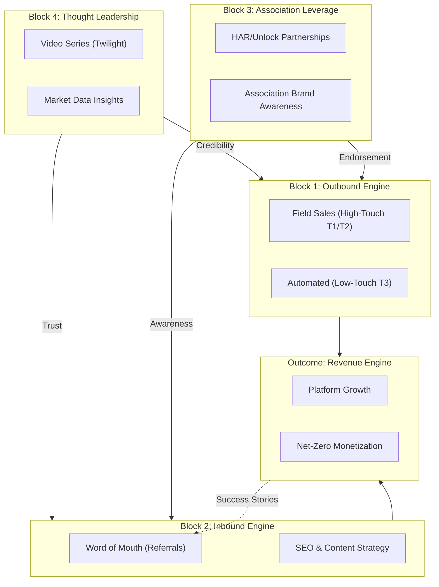

# Jointly Marketing Plan (FY 2026)

## 1. Executive Summary
This plan outlines the strategic marketing initiatives required to achieve Jointly's growth target of **30 new deals** and **$40,000 in new MRR** by end of FY 2026. Our strategy is built on a modular growth engine that balances high-touch relationship building with automated data-driven outreach.

## 2. Market Segmentation
We categorize our target market based on transaction velocity and compliance risk.

| Segment | Profile | Primary Driver | Core Hook |
| :--- | :--- | :--- | :--- |
| **Tier 1 (Enterprise)** | 50+ Agents | Risk & Brand Standard | "The Operating System for Modern Brokerage." |
| **Tier 2 (Growth)** | 16–50 Agents | Scaling without Headcount | "Scale volume, not admin time." |
| **Tier 3 (Boutique)** | 1–15 Agents | Compliance & Retention | "Infrastructure over Splits." |

---

## 3. The Building Blocks of the Growth Engine

### Block 1: The Outbound Engine (Active Market Capture)
We bifurcate our outbound efforts based on account value and complexity to maximize ROI.
*   **Field Sales (High Touch):** Targeting **Tier 1** and **High-End Tier 2** accounts. 
    - **Strategy:** Relationship-driven sales cycle led by Devin and the AE team. 
    - **Focus:** Multi-office consistency, enterprise risk mitigation, and custom tech ecosystem integration.
*   **Automated Outreach (Low Touch):** Targeting **Tier 3** accounts.
    - **Strategy:** Data-triggered sequences using **Katarina AI**.
    - **Focus:** 15-minute "Speed Demos" triggered by **TREC Sponsorship Deltas** (new hires) and **MLS Production Spikes**.

### Block 2: The Inbound Engine (Demand Generation)
Building a sustainable pipeline through community and discoverability.
*   **Word of Mouth (WOM):** Operationalizing referrals by leveraging our **"Net-Zero" success stories**. Turning current power users into brand advocates.
*   **SEO & Content Strategy:** Creating targeted, high-intent educational content.
    - **Focus:** Articles and guides on "Texas Real Estate Compliance," "Scaling a Boutique Firm without Admin Overhead," and "TREC Form Automation."
*   **Infrastructure ROI (The "Sticky" Inbound):** Offering modern **Webflow-powered** website replacements with automated lead-to-deal intake, listing sync, and a professional **"Content Kickstart"** (photography/video) package. This creates a "Product-Led" inbound loop where the website itself becomes a high-value entry point.
*   **Inbound Loops:** Capturing interest from social authority and search to feed into the AE pipeline.

### Block 3: MLS / Association Leverage (Brand Awareness)
Utilizing the existing ecosystem to create broad-scale brand recognition.
*   **Strategic Partnerships:** Leveraging **HAR** and **Unlock MLS** as primary trust anchors.
*   **Ecosystem Integration:** Positioning Jointly as the "Standard" through association-endorsed webinars, regional events, and subsidized "Association Editions."
*   **Awareness Play:** Using association channels to broadcast Jointly's value to the entire licensed Texas agent base.

### Block 4: Thought Leadership (Authority Building)
Building long-term brand equity by being the smartest voice in the room.
*   **Video Authority:** Partnership with **Twilight Productions** for high-production weekly content.
    - **Format:** "The State of the Deal" — Devin Dvorak analyzing market data, compliance trends, and the future of real estate operations.
*   **Data Insights:** Publishing quarterly "Texas Transaction Reports" using aggregated (anonymized) data to show productivity trends across the state.

---

## 4. Financial Guardrails (Unit Economics)
*   **LTV:CAC Target:** 5:1 (Industry best-in-class).
*   **Max Marketing CAC:** $3,200 per closed deal.
*   **Max Lead Cost:** $1,066 (assuming a 33% close rate).
*   **Cash Payback:** < 3 months.

*Reference: [[sales-acquisition-budget-analysis]]*

## 5. Campaign Calendar (Q1 - Q2 2026)

| Month | Theme | Primary Initiative |
| :--- | :--- | :--- |
| **March** | The "Squeeze" | Launch Thought Leadership video series: "Infrastructure over Splits." |
| **April** | HAR Rollout | Launch Association Leverage campaign for HAR members. |
| **May** | SEO Push | Release "The Texas Broker's Guide to 2026 Compliance." |
| **June** | Mid-Year Reset | "Net-Zero" Referral Drive: Rewarding WOM advocates. |

## 6. KPIs & Success Metrics
*   **Velocity:** 15 Qualified Leads per week.
*   **Conversion:** 33% from Demo to Close.
*   **Authority:** 10k+ Monthly Views on Devin-led thought leadership content.
*   **Efficiency:** Under 3-month cash payback on all marketing spend.

## 7. Strategic R&D & Future Levers
We are continuously investigating high-impact multipliers to add to the growth engine.
*   **Expired Listing Lead Gen:** Investigating the dynamics of capturing and distributing expired listing leads.
    - **Models under review:** 1) Enterprise Reseller partnership, 2) "Bring Your Own Key" (BYOK) SaaS integration, and 3) "Done-For-You" Appointment Setting agency model.
    - *Reference: [[gtm/tier-3-assets/seller-lead-legal-models]]*
*   **AI-Powered Recruiting Scrapers:** Further refining automated identification of high-potential agents for our brokerage partners to use as a recruitment tool.

---

## 8. The Growth Engine (Visual)

